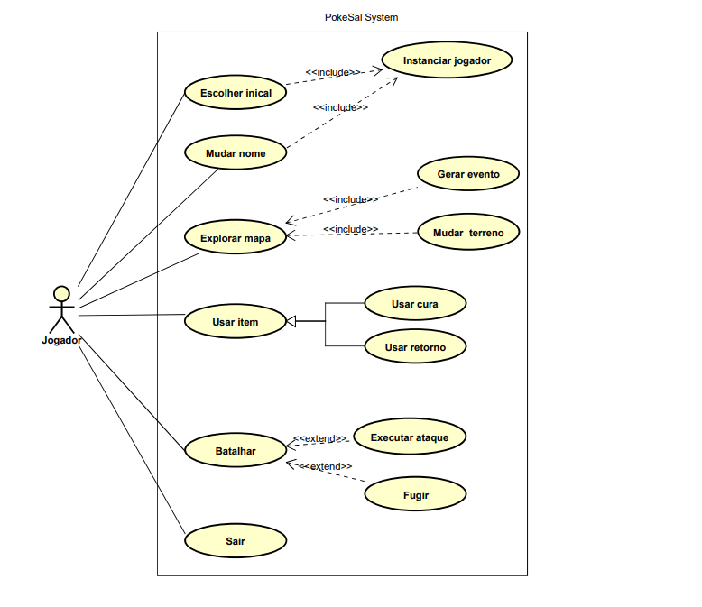

# Projeto_PokeSal
Relatório de requisitos:\
De início, os requisitos iniciais e autorais estavam se adequando ao código, mas, ao avançar nos requisitos, o código se tornou cada vez mais difícil de atualizar e adequar para novas funcionalidades. Isso decorreu de uma falta de estrutura inicial para o sistema e da má utilização e criação dos modelos das peças do sistema.

Relatório de contribuição:\
O projeto foi realizado somente por um indivíduo: Kaio de Jesus Rosales Costa.

Requisitos adicionais:

1. O sistema deve permitir que o jogador mude o nome do personagem.\
    1.1. Após a classe Jogador ser instanciada no método "main", haveria uma opção de configuração e, dentro dela, estaria a opção de trocar o nome default (Dummy).

2. O jogador pode andar pelos campus da UCSAL.\
    2.1. Na classe de serviços, foi criada a matriz "localizacao", uma matriz de 3 linhas, em que 2 linhas têm 3 colunas e a terceira somente uma.\
    2.2. Quando o jogador navegava pela matriz, os 'O's eram trocados por '1's, até chegar ao limite de colunas da linha.\
    2.3. Era possível retornar o avanço, apagando assim os rastros de '1's pela matriz.\
    2.4. Haveria um item chamado "ReturnPass", que permitiria ao jogador voltar para o início de maneira segura e apagaria todos os rastros.

3. Eventos aleatórios devem acontecer quando se faz um movimento de ida ou de volta.\
    3.1. Cada movimentação do jogador acionaria um evento e um terreno.\
    3.2. Os eventos consistiam em achar um item aleatório ou encontrar um "PokeSal" selvagem, ocasionando uma batalha.\
    3.3. Os terrenos eram aleatórios, sendo eles "Quente", "Molhado" e "Florido", cada um com suas peculiaridades. Era possível não pegar nenhum.

## Fase 2
Checklist de Teste Estático de Código (Revisão Manual):
1. Variáveis inicializadas antes do uso? \
    As variáveis inicializadas antes do uso seriam a matriz localização, usada como "mapa" para movimentação do jogador, as variáveis  escolha e caminho também usadas para movimentação, porém na modificações de valores na matriz e uma menção extra seria para os atributos dos PokeSals que tem valores base.
2. Variáveis/métodos declarados e nunca usados? \
    Os setters setHpMax, setDef e setSpd em *ChikoSal, CyndaSal e TotoSal*, acabaram não sendo utilizados.
3. Código inacessível? \
    Não encontrei códigos inacessíveis.
4. Código duplicado? \
    *ChikoSal, CyndaSal, TotoSal* são parecidos, uma possível herança de uma falta de planejamento e os métodos avancarMovimento() e retornarMovimento() da classe *Servicos* repetem o mesmo loop para percorrer a matriz.
5. Erros de sintaxe? \
    Não encontrei problema ao compilar o código.
6. Erros de lógica que quebram regras do negócio?\
    Ao usar a opção "Usar Itens" no menu da classe *Main* é possível notar que os itens não são empilhados de maneira totalmente correta.
7. Erros de tipagem? \
    Não encontrei erro de tipagem.
8. Fluxo de controle válido (sem loops infinitos/condições impossíveis)? \
    Não encontrei falhas em loops que tornem o fluxo infinito.